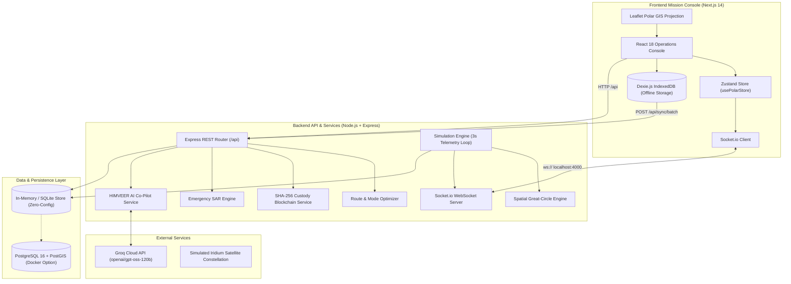

# Integrated Polar Expedition Logistics & Asset Management System (Prototype)

<div align="center">

**Built for the Smart India Hackathon (SIH)**  
**Ministry of Earth Sciences (MoES) — National Centre for Polar and Ocean Research (NCPOR)**  
*Governing the 44th Indian Scientific Expedition to Antarctica (ISEA)*

[-black?style=flat&logo=next.js)](https://nextjs.org/)
[](https://react.dev/)
[](https://nodejs.org/)
[](https://www.typescriptlang.org/)
[](https://leafletjs.com/)
[-7C3AED?style=flat)](https://dexie.org/)
[](https://socket.io/)
[-F55036?style=flat)](https://groq.com/)
[](https://postgis.net/)

</div>

---

## Table of Contents

1. [Executive Summary & Problem Statement](#1-executive-summary--problem-statement)
2. [Key Capabilities & Engineering Innovations](#2-key-capabilities--engineering-innovations)
3. [Geographical & Polar Mission Context](#3-geographical--polar-mission-context)
4. [Real-World Polar Constraints & Mathematical Models](#4-real-world-polar-constraints--mathematical-models)
5. [System Architecture & Data Flow](#5-system-architecture--data-flow)
6. [Console Modules & UI Deep Dive](#6-console-modules--ui-deep-dive)
7. [Complete REST API Reference](#7-complete-rest-api-reference)
8. [Real-Time WebSocket Telemetry Protocol](#8-real-time-websocket-telemetry-protocol)
9. [Role-Based Access Control (RBAC) & Personas](#9-role-based-access-control-rbac--personas)
10. [HIMVEER Tactical AI Co-Pilot](#10-himveer-tactical-ai-co-pilot)
11. [Installation & Deployment Guide](#11-installation--deployment-guide)
12. [Live Judging Walkthrough Script](#12-live-judging-walkthrough-script)
13. [Codebase Directory Structure](#13-codebase-directory-structure)

---

## 1. Executive Summary & Problem Statement

The **National Centre for Polar and Ocean Research (NCPOR)**, under the **Ministry of Earth Sciences (MoES)**, operates India's permanent research stations in Antarctica: **Maitri** (established 1989 in the Schirmacher Oasis) and **Bharati** (commissioned 2012 in the Larsemann Hills).

### The Operational Challenge
Managing Antarctic expedition logistics is one of the most hostile supply-chain problems on Earth:
- **Austral Summer Window**: Ship access (*MV Vasiliy Golovnin*) is physically possible only between **November and March**. For the remaining 7–8 months of the polar winter, stations are locked in total isolation.
- **Air Reach Constraints**: Light polar aircraft (**Basler BT-67**, **DHC-6 Twin Otter**) cannot fly directly from Cape Town to Bharati due to extreme oceanic distances (>6,800 km). All air cargo must stage through Maitri and make a mandatory refueling stop at an unmanned intermediate skiway fuel cache (`70.2°S, 42.0°E`).
- **Extreme Weather & Katabatic Blizzards**: Temperatures plunge to -50°C and hurricane-force katabatic winds exceed 85 knots, instantly altering daily fuel burn rates and paralyzing airfield operations.
- **Intermittent Satellite Blackouts**: High-latitude communications rely on low-angle Iridium satellite constellations, causing frequent link drops and communication blackouts where station crews cannot access cloud systems.
- **Custody & Cold-Chain Integrity**: Scientific ice core samples, biological specimens, and sensitive equipment must be cryptographically verified across multi-modal handoffs to prevent loss, damage, or tampering.

### The Solution: Polar Operations Mission Control Console
This system is an operational, mission-control grade full-stack platform designed to automate, monitor, and optimize polar logistics, asset custody, resupply forecasting, personnel rotation, and search-and-rescue (SAR) protocols for the Indian Antarctic Expeditions.

---

## 2. Key Capabilities & Engineering Innovations

| Feature | Engineering Implementation | Operational Impact |
| :--- | :--- | :--- |
| **Polar GIS Tactical Tracking** | High-Latitude Mercator projection with geodesic great-circle waypoint interpolation. | Real-time tracking of *MV Vasiliy Golovnin* and *Basler BT-67* across the Southern Ocean with dynamic waypoint telemetry. |
| **Strict Flight Corridor Engine** | Enforces the mandatory Maitri staging corridor and skiway fuel depot stop (`70.2°S, 42.0°E`). Rejects illegal direct flights to Bharati. | Prevents loss-of-aircraft incidents over the Southern Ocean. |
| **Smart Cargo Splitter** | Mathematical partitioning algorithm enforcing Basler BT-67 (2,500 kg) & Twin Otter (1,400 kg) payload ceilings. | Automatically splits overweight shipments into multi-sortie flights or routes overflow to ship holds. |
| **Cryptographic Custody Ledger** | Immutable SHA-256 block chaining with recursive chain verification and simulated tamper detection. | Guarantees tamper-evident chain of custody for high-value scientific samples and critical spare parts. |
| **Resupply Depletion Forecasting** | Linear depletion burn-rate modeling calibrated against the November 15 Austral Summer window. | Predicts exact days-until-depletion, alerts winter lock-in hazards, and triggers emergency Level-2 fuel rationing (-22%). |
| **15-Month Winter-Over Suite** | Crew rotation tracking (days-in-post, polar night exposure, readiness score) and emergency donor matching. | Identifies life-saving surgical blood matches (e.g. O- universal donors) in seconds during station medical emergencies. |
| **Offline-First Field Terminal** | Client-side IndexedDB storage (via Dexie.js) with background satellite burst-sync (`POST /api/sync/batch`). | Enables field scientists to dispense inventory and log crevasse hazards outside radio range; auto-syncs when satellite links open. |
| **HIMVEER Tactical AI Co-Pilot** | Ultra-low latency Groq LLM integration (`openai/gpt-oss-120b`) augmented with real-time station telemetry and actionable console commands. | Answers operational questions, triggers simulations, and enacts emergency directives via natural language. |
| **Multi-Scenario Injectors** | Dynamic time-warp (1x, 10x, 60x), Blizzard injector (+40% diesel burn), and SATCOM blackout toggle. | Allows mission controllers and hackathon evaluators to test contingency responses under simulated crises. |

---

## 3. Geographical & Polar Mission Context

The platform models the four primary operational nodes of the Indian Antarctic Programme:

```
[ NCPOR HQ (Goa) ] 15°23′N, 73°48′E
        |
        v Strategic Governance & Airlift Clearance
[ Cape Town Hub (FACT) ] 33°55′S, 18°25′E
        |
        +-----------------------------------+
        | (DROMLAN Air Bridge: 4,200 km)     | (Maritime Voyage: 10-14 days)
        v                                   v
[ Maitri Station ]                     [ Bharati Station ]
  70°45′58″S, 11°43′56″E                 69°24′28″S, 76°11′14″E
  Schirmacher Oasis (Inland)             Larsemann Hills (Coastal)
  Novo Blue-Ice Runway (15 km)           Fast-Ice Wharf & Helipad
        |                                   ^
        +---> [ Skiway Fuel Depot ] --------+
              70.2°S, 42.0°E (Mandatory Refuel)
```

### Station Specifications
1. **Maitri Station** (`70°45′58″S, 11°43′56″E`):
   - **Environment**: Inland ice-free Schirmacher Oasis, altitude 130 m.
   - **Aviation**: Novolazarevskaya Blue-Ice Runway (ALCI / DROMLAN intercontinental staging hub, 15 km away).
   - **Logistical Role**: Polar gateway for personnel and light cargo entering Queen Maud Land.
2. **Bharati Station** (`69°24′28″S, 76°11′14″E`):
   - **Environment**: Coastal Larsemann Hills, altitude 35 m.
   - **Maritime/Aviation**: Fast-ice wharf and helipad in Prydz Bay; sea access for heavy bulk fuel and containerized cargo.
   - **Logistical Role**: Oceanographic, atmospheric, and tectonic research headquarters.
3. **Mid-Way Skiway Fuel Depot** (`70.2°S, 42.0°E`):
   - **Environment**: Polar ice-plateau cache.
   - **Logistical Role**: Unmanned skiway fuel depot with cached Jet A-1 fuel drums; essential for bridging the 2,680 km distance between Maitri and Bharati.
4. **Cape Town Gateway Logistics Hub** (`33°55′S, 18°25′E`):
   - **Facilities**: Cape Town International Airport (FACT) & Cape Town Port.
   - **Logistical Role**: Global marshaling point for scientific expeditioners, Antarctic cargo, and icebreaker staging.
5. **NCPOR Headquarters, Goa** (`15°23′N, 73°48′E`):
   - **Facilities**: Ministry of Earth Sciences command headquarters.
   - **Logistical Role**: Strategic authority, financial authorization, and inter-ministry emergency clearances.

---

## 4. Real-World Polar Constraints & Mathematical Models

### 4.1. Geodesic Great-Circle Distance & Interpolation
Distances between geographic points $(lat_1, lon_1)$ and $(lat_2, lon_2)$ are calculated using the spherical law of cosines and Haversine formula:

$$d = 2R \arcsin\left(\sqrt{\sin^2\left(\frac{\Delta \phi}{2}\right) + \cos(\phi_1)\cos(\phi_2)\sin^2\left(\frac{\Delta \lambda}{2}\right)}\right)$$

Where $R = 6,371\text{ km}$. Geodesic point interpolation along a flight leg for fraction $f \in [0, 1]$ is computed in `backend/src/services/spatialEngine.ts`:

$$A = \frac{\sin((1-f)d)}{\sin(d)}, \quad B = \frac{\sin(fd)}{\sin(d)}$$
$$x = A \cos\phi_1 \cos\lambda_1 + B \cos\phi_2 \cos\lambda_2$$
$$y = A \cos\phi_1 \sin\lambda_1 + B \cos\phi_2 \sin\lambda_2$$
$$z = A \sin\phi_1 + B \sin\phi_2$$
$$\phi_f = \arctan2(z, \sqrt{x^2 + y^2}), \quad \lambda_f = \arctan2(y, x)$$

### 4.2. Aviation Payload Ceilings & Smart Cargo Splitter
- **Basler BT-67 Ceiling**: $2,500\text{ kg}$ maximum ski-landing payload.
- **DHC-6 Twin Otter Ceiling**: $1,400\text{ kg}$ maximum ski-landing payload.

When a shipment $W$ exceeds $2,500\text{ kg}$ and urgent air dispatch is requested:
1. $\text{Sortie}_1 = 2,500\text{ kg}$ (Dispatched immediately on Basler BT-67).
2. $\text{Remaining} = W - 2,500\text{ kg}$.
3. $\text{Sortie}_2 = \min(\text{Remaining}, 2,500\text{ kg})$.
4. $\text{Sea Overflow} = \max(0, \text{Remaining} - 2,500\text{ kg})$ (Reallocated to *MV Vasiliy Golovnin* vessel hold).

### 4.3. Sea-Ice Severity Multiplier
Maritime voyage duration from Cape Town to Bharati depends on pack-ice density in Prydz Bay:
- **Low Pack Ice (0–20%)**: Multiplier $1.0\times$ (Transit: $\sim 140\text{ hours}$).
- **Moderate Pack Ice (30–50%)**: Multiplier $1.25\times$ (+2.5 days added).
- **Severe Pack Ice (70–90%)**: Multiplier $1.75\times$ (+6.0 days added due to icebreaker ramming mode).

### 4.4. Resupply Depletion & Austral Summer Locking Formula
- Let $S_t$ be the current inventory stock (e.g. Arctic diesel in liters).
- Let $B$ be the daily burn rate ($\text{L/day}$).
- Days until depletion: $D = \left\lfloor \frac{S_t}{B} \right\rfloor$.
- Days until next Austral resupply window ($T_{\text{resupply}} = \text{Nov 15}$): $D_{\text{resupply}} \approx 140\text{ days}$.
- **Critical Winter Lock-in Condition**: If $D < D_{\text{resupply}}$, station faces life-threatening depletion before ship arrival.
- **Level-2 Rationing Protocol**: Reduces burn rate by $22\%$ ($B_{\text{new}} = 0.78 \cdot B$), extending fuel reserves past the November cutoff.

### 4.5. SHA-256 Cryptographic Chain of Custody
Each handoff entry block $B_i$ contains:
$$\text{Hash}_i = \text{SHA256}(i \parallel \text{Hash}_{i-1} \parallel \text{Timestamp} \parallel \text{ActorID} \parallel \text{Location} \parallel \text{Action} \parallel \text{Condition})$$
If any historical block $B_k$ is mutated in the ledger, $\text{Hash}_k \neq \text{RecalculatedHash}_k$ and $B_{k+1}.\text{prev\_hash} \neq \text{Hash}_k$, triggering an instantaneous **CRYPTOGRAPHIC BREACH ALERT** on the operations console.

---

## 5. System Architecture & Data Flow



---

## 6. Console Modules & UI Deep Dive

### 6.1. Module 1: Tactical Polar GIS Map
- High-latitude Mercator projection displaying the entire Southern Ocean transect from Cape Town (`33°55′S`) down to Maitri (`70°46′S`) and Bharati (`69°24′S`).
- **Live Moving Entities**:
  - *MV Vasiliy Golovnin* (Russian ice-class cargo vessel) navigating through the Roaring Forties and Antarctic pack-ice.
  - *Basler BT-67 Polar Star 1* (ski-equipped utility aircraft) flying along the DROMLAN polar air bridge.
- **Waypoints & Refueling Hubs**: Highlights the **Mid-Way Skiway Fuel Depot** (`70.2°S, 42.0°E`) and Novolazarevskaya Blue-Ice Runway.
- **Floating Telemetry HUD**: Clicking any route or vessel opens real-time speed, heading, sea-ice density, remaining distance, and onboard manifest.

### 6.2. Module 2: Cargo & Cryptographic Custody Ledger
- Tracks critical polar assets across 5 categories: `fuel`, `scientific-equipment`, `medical`, `food`, and `spares`.
- **Block Chain Explorer**: Visualizes the immutable SHA-256 ledger for each asset (Genesis block $\to$ Cape Town customs $\to$ Vessel hold $\to$ Station receipt).
- **Tamper Simulation**: Click **"Simulate Tamper"** to mutate a historical block in-memory. The chain verification algorithm detects the mismatch and triggers a bright red **CRYPTOGRAPHIC TAMPER BREACH** modal.
- **One-Click Chain Repair**: Restores audit integrity.
- **Append Handoff**: Allows authorized users to sign and link a new custody block.

### 6.3. Module 3: Multi-Modal Route & Air/Sea Optimizer
- **Origin & Destination Selector**: Cape Town, Maitri, Bharati, Goa HQ.
- **Cargo Parameters**: Dynamic weight slider (100 kg to 10,000 kg), category, priority, and sea-ice severity selector.
- **Constraint Enforcement**:
  - Automatically identifies that Cape Town $\to$ Bharati cannot be flown directly.
  - Automatically breaks the flight into: *Cape Town $\to$ Maitri Blue-Ice Runway (4,200 km) $\to$ Skiway Fuel Depot (1,340 km) $\to$ Bharati Station (1,340 km)*.
- **Smart Cargo Splitter**: If cargo weight exceeds 2,500 kg for an urgent air request, generates a partitioned sortie proposal:
  - *Sortie 1*: 2,500 kg (Basler BT-67).
  - *Sortie 2*: Remaining balance.
  - *Sea Overflow*: Overflow volume routed to vessel cargo hold.

### 6.4. Module 4: Inventory & Resupply Forecasting
- Tracks bulk assets: Arctic Diesel (polar grade -50°C), Aviation Jet A-1, Medical Oxygen, Freeze-Dried Rations, Generator Spares.
- **Linear Depletion Model**: Calculates real-time daily burn rate and days-until-depletion.
- **Winter Lock-in Warning**: Flags items that will deplete before the **November 15** Austral Summer shipping window.
- **Level-2 Rationing Enactment**: Click **"Enact Rationing (-22%)"** to dynamically lower consumption rate and extend survival buffer.

### 6.5. Module 5: Personnel & 15-Month Winter-Over Suite
- Comprehensive tracking for 40+ crew members stationed at Maitri, Bharati, Cape Town, and aboard *MV Vasiliy Golovnin*.
- **Metrics**: Days-in-post (against 450-day maximum limit), polar night darkness exposure counter, psychological readiness score, medical fitness classification.
- **Emergency Donor Compatibility Matrix**: Click blood group buttons (`O-`, `A+`, `B+`, etc.) to instantly identify qualified on-station surgical blood donors for emergency field transfusions.

### 6.6. Module 6: Emergency Response (SAR Protocol)
- Rapid emergency declaration for three critical polar scenarios:
  1. **Critical MEDEVAC**: High-priority aero-medical evacuation with ICU-rigged Basler BT-67, Cape Town trauma hospital reception, and HF radio channel `8.291 MHz USB`.
  2. **Code-Red Blizzard Lockdown**: Category-5 Katabatic whiteout; grounds all aircraft, seals habitation blast doors, and routes power to life-support circuits.
  3. **Fuel Tank Rupture**: Bulk diesel containment breach protocol.
- Automatically generates an official structured **MoES Emergency Incident Order** with a unique clearance code (`MOES-NCPOR-AUTH-XXXXXX`).

### 6.7. Module 7: Offline-First Field Terminal (`/field`)
- Engineered specifically for station personnel operating on snowmobiles or in outlying field camps outside VHF/Iridium coverage.
- Uses **IndexedDB** via Dexie.js for 100% offline local persistence.
- **Interactive SATCOM Toggle**: Switch satellite link from **ACTIVE** to **CLOSED**.
- **Offline Actions**: Dispense inventory or report field crevasse hazards with automatic GPS capture. Actions queue locally with an amber badge (`Pending Sync: N`).
- **Burst Synchronization**: Toggling satellite link back to **ACTIVE** instantly flushes the offline queue to the backend via `POST /api/sync/batch`.

### 6.8. Module 8: NCPOR Goa HQ Strategic Command Deck
- Executive dashboard for Ministry officials in Goa.
- High-level KPIs: 1,42,000 L expedition fuel security, 52 active scientists, +18.4% supply chain efficiency.
- Digital sign-off and approval queue for inter-station asset reallocations and Basler flight sorties.

### 6.9. Module 9: Top Status Bar & Simulation Controls
- **Expedition Day Counter**: `Day 142 / 450` (Active Winter-Over Phase).
- **Time-Warp Slider**: Accelerate simulation time (`1x`, `10x`, `60x`).
- **Scenario Injectors**:
  - **"Inject Blizzard"**: Maitri temperature plunges to -42°C, wind spikes to 86 kt, and diesel consumption jumps by +40%.
  - **"SATCOM Link"**: Simulates Iridium satellite blackout.
- **Role Switcher**: Switch on-the-fly between Expedition Lead, Logistics Officer, Medical Officer, Field Personnel, and NCPOR HQ.

---

## 7. Complete REST API Reference

All REST endpoints are served under `http://localhost:4000/api`.

### 7.1. Authentication & Users
| Method | Endpoint | Description | Request Body / Query | Success Response |
| :--- | :--- | :--- | :--- | :--- |
| `POST` | `/api/auth/login` | Login by user email or role | `{ "role": "expedition_lead" }` | `{ "token": "jwt...", "user": {...} }` |
| `GET` | `/api/auth/me` | Get current authenticated user profile | Header: `Authorization: Bearer <token>` | `{ "user": {...} }` |
| `GET` | `/api/auth/users` | List all available demo personas | None | `{ "users": [...] }` |

### 7.2. Stations & Geographic Nodes
| Method | Endpoint | Description | Request Body / Query | Success Response |
| :--- | :--- | :--- | :--- | :--- |
| `GET` | `/api/stations` | Retrieve all 4 polar nodes with live weather & occupancy | None | `{ "stations": [...] }` |
| `GET` | `/health` | Backend operational health check | None | `{ "status": "ONLINE", "stations_active": 2, ... }` |

### 7.3. Assets & Cryptographic Custody Ledger
| Method | Endpoint | Description | Request Body / Query | Success Response |
| :--- | :--- | :--- | :--- | :--- |
| `GET` | `/api/assets` | Retrieve all tracked assets (filter by category / station) | `?category=scientific-equipment&station=maitri` | `{ "assets": [...], "count": 12 }` |
| `GET` | `/api/assets/:id` | Get single asset and calculate cryptographic chain integrity | Path: `id` | `{ "asset": {...}, "integrity": { "isValid": true } }` |
| `POST` | `/api/assets` | Register new asset and generate Genesis block | `{ "name": "...", "category": "spares", "weight_kg": 250, ... }` | `201 Created: { "asset": {...} }` |
| `POST` | `/api/assets/:id/custody` | Append signed custody handoff block | `{ "actor_id": "usr-01", "action": "TRANSFER", "location": "Novo" }` | `{ "asset": {...}, "integrity": { "isValid": true } }` |
| `POST` | `/api/assets/:id/tamper` | **Tamper Injection**: Mutate historical block string | `{ "block_index": 0 }` | `{ "message": "TAMPER_INJECTED", "integrity": { "isValid": false } }` |
| `POST` | `/api/assets/:id/repair` | Recompute and repair broken cryptographic chain | None | `{ "message": "REPAIRED", "integrity": { "isValid": true } }` |
| `GET` | `/api/assets/:id/verify` | Verify SHA-256 chain integrity on demand | Path: `id` | `{ "isValid": true | false, "errorReason": "..." }` |

### 7.4. Inventory & Resupply Forecasting
| Method | Endpoint | Description | Request Body / Query | Success Response |
| :--- | :--- | :--- | :--- | :--- |
| `GET` | `/api/inventory` | Retrieve inventory items across all stations | `?stationId=maitri` | `{ "inventory": [...], "count": 14 }` |
| `GET` | `/api/inventory/:stationId` | Retrieve items for a specific station | Path: `stationId` (`maitri` or `bharati`) | `{ "station_id": "maitri", "inventory": [...] }` |
| `GET` | `/api/inventory/:stationId/forecast` | Austral summer depletion analysis against Nov 15 cutoff | Path: `stationId` | `{ "resupply_window": {...}, "critical_alerts_count": 1, "forecast": [...] }` |
| `POST` | `/api/inventory/:id/ration` | Enact Level-2 Rationing protocol (-22% consumption) | Path: `id` | `{ "message": "Level-2 Rationing enacted", "item": {...} }` |

### 7.5. Personnel & Winter-Over Lifecycle
| Method | Endpoint | Description | Request Body / Query | Success Response |
| :--- | :--- | :--- | :--- | :--- |
| `GET` | `/api/personnel` | List all 40+ deployed crew members | `?stationId=maitri&location=Maitri` | `{ "personnel": [...], "count": 42 }` |
| `PATCH` | `/api/personnel/:id/location` | Transfer crew member between stations or vessels | `{ "location": "Bharati", "station_id": "bharati" }` | `{ "personnel": {...} }` |
| `GET` | `/api/personnel/donors/:bloodGroup` | Find compatible emergency surgical blood donors | Path: `bloodGroup` (`O-`, `A+`, `B+`, etc.) | `{ "recipient_blood_group": "O-", "donors": [...] }` |
| `GET` | `/api/personnel/summary` | Winter-over statistics, average days in post, readiness | None | `{ "total_deployed_crew": 42, "avg_days_in_post": 142, ... }` |

### 7.6. Multi-Modal Route Optimization
| Method | Endpoint | Description | Request Body / Query | Success Response |
| :--- | :--- | :--- | :--- | :--- |
| `GET` | `/api/routes` | Get active transit legs, vessel progress & waypoints | None | `{ "legs": [...] }` |
| `GET` | `/api/routes/recommend` | Calculate optimal air/sea routing with polar constraints | `?origin=Cape Town&destination=Bharati&weight=4500&category=spares&urgency=critical` | `{ "recommendation": { "recommended_mode": "split", "maitri_stopover_required": true, ... } }` |

### 7.7. Emergency SAR Protocols
| Method | Endpoint | Description | Request Body / Query | Success Response |
| :--- | :--- | :--- | :--- | :--- |
| `GET` | `/api/emergency` | List active and historical emergency incidents | None | `{ "incidents": [...], "count": 2 }` |
| `POST` | `/api/emergency/trigger` | Trigger MEDEVAC, Blizzard Lockdown, or Fuel Rupture | `{ "type": "medical_evacuation", "station_id": "maitri", "notes": "..." }` | `{ "message": "Incident enacted", "incident": { "clearance_code": "MOES-AUTH-...", ... } }` |
| `GET` | `/api/emergency/:id` | Get incident details and evacuation action checklist | Path: `id` | `{ "incident": {...} }` |

### 7.8. Offline Field Synchronization
| Method | Endpoint | Description | Request Body / Query | Success Response |
| :--- | :--- | :--- | :--- | :--- |
| `POST` | `/api/sync/batch` | Flush queued IndexedDB actions from field terminal | `{ "actions": [ { "id": "...", "action_type": "...", "payload": {...} } ] }` | `{ "message": "Batch sync complete", "processed": 2, "failed": 0 }` |

### 7.9. Simulation & Scenario Injectors
| Method | Endpoint | Description | Request Body / Query | Success Response |
| :--- | :--- | :--- | :--- | :--- |
| `GET` | `/api/simulation/state` | Current time-warp, blizzard status, SATCOM status | None | `{ "simulation": {...}, "satellite": {...} }` |
| `POST` | `/api/simulation/time-warp` | Set simulation acceleration factor | `{ "warp": 1 | 10 | 60 }` | `{ "message": "Time warp set", "simulation": {...} }` |
| `POST` | `/api/simulation/blizzard` | Inject or clear katabatic blizzard conditions | `{ "active": true | false }` | `{ "message": "BLIZZARD INJECTED", "simulation": {...} }` |
| `POST` | `/api/simulation/satellite-blackout` | Inject or restore Iridium satellite blackout | `{ "blackout": true | false }` | `{ "message": "SATELLITE BLACKOUT INJECTED", ... }` |
| `POST` | `/api/simulation/toggle-satellite` | Toggle satellite link state (Active $\leftrightarrow$ Closed) | None | `{ "satellite": { "status": "closed" | "active" } }` |

### 7.10. HIMVEER AI Co-Pilot (Groq Powered)
| Method | Endpoint | Description | Request Body / Query | Success Response |
| :--- | :--- | :--- | :--- | :--- |
| `POST` | `/api/ai/chat` | Send conversational prompt to HIMVEER co-pilot | `{ "messages": [ { "role": "user", "content": "..." } ], "api_key": "..." }` | `{ "response": "...", "model": "Groq (openai/gpt-oss-120b)", "source": "groq" }` |
| `GET` | `/api/ai/status` | Check if Groq API key is configured | None | `{ "configured": true, "maskedKey": "gsk_...jr0" }` |
| `POST` | `/api/ai/config` | Set or update Groq API key dynamically | `{ "apiKey": "gsk_..." }` | `{ "success": true, "configured": true }` |

---

## 8. Real-Time WebSocket Telemetry Protocol

The backend runs a background telemetry loop on **port 4000** broadcasting real-time updates every **3 seconds** (accelerated by the time-warp multiplier).

```javascript
// Connect to WebSocket server
import { io } from 'socket.io-client';
const socket = io('http://localhost:4000');
```

### Broadcast Events
1. `telemetry:bootstrap` *(Sent immediately upon client connection)*:
   ```json
   {
     "simulation": { "time_warp": 1, "is_blizzard_active": false, "expedition_day": 142 },
     "satellite": { "status": "active", "bandwidth_kbps": 128, "constellation": "Iridium NEXT Ring 4" },
     "stations": [ ... ]
   }
   ```
2. `simulation:state_changed` *(Broadcast on time-warp, day progression, or blizzard injection)*:
   ```json
   {
     "time_warp": 10,
     "is_blizzard_active": true,
     "expedition_day": 142.4
   }
   ```
3. `satellite:state_changed` *(Broadcast when satellite blackout is triggered or restored)*:
   ```json
   {
     "status": "closed",
     "bandwidth_kbps": 0,
     "signal_strength_pct": 0
   }
   ```
4. `route:progress_update` *(Broadcast every 3 seconds with updated vessel/aircraft coordinates)*:
   ```json
   {
     "leg_id": "leg-sea-01",
     "vehicle_name": "MV Vasiliy Golovnin",
     "current_position": [-54.1205, 14.5321],
     "progress_pct": 42.5
   }
   ```

---

## 9. Role-Based Access Control (RBAC) & Personas

The application features 5 distinct operational personas. Switch roles instantly via the top status bar:

| Role Identifier | Role Name | Station / Node | Capabilities & Permissions |
| :--- | :--- | :--- | :--- |
| `expedition_lead` | **Expedition Leader** | Maitri (`MAI-01`) | Full executive command, declare polar emergencies, enact rationing, inject crisis scenarios. |
| `logistics_officer` | **Logistics Officer** | Cape Town Hub | Manage cargo ledger, append handoff blocks, run multi-modal route optimizer, split shipments. |
| `medical_officer` | **Chief Medical Officer** | Bharati (`BHA-02`) | Access winter-over readiness, trigger MEDEVAC protocols, execute emergency blood donor matching. |
| `station_personnel` | **Field Scientist / Crew** | Field Terminal (`/field`) | Offline inventory dispense, log crevasse hazards in IndexedDB, trigger satellite burst-sync. |
| `ncpor_hq` | **NCPOR Directorate** | Goa HQ | Ministry-level governance, sign-off on flight sorties, inter-station asset reallocations. |

---

## 10. HIMVEER Tactical AI Co-Pilot

**HIMVEER (हिमवीर)** is an AI Logistics & Operations Co-Pilot named after the legendary guardians of the snows.

### Architecture & Capabilities
- **Groq Integration**: Powered by Groq's LPU inference engine running `openai/gpt-oss-120b` (or LLaMA-3.3-70B) with sub-second response times.
- **Dynamic Telemetry Context**: Every query automatically injects real-time station weather, current fuel levels, active transit positions, and satellite status into the prompt context.
- **Direct Console Directives**: HIMVEER can execute operational commands on the console interface using structured action blocks:
  ```json
  ```action
  {
    "action": "TRIGGER_BLIZZARD",
    "params": { "active": true }
  }
  ```
  Supported actions: `TRIGGER_BLIZZARD`, `CLEAR_BLIZZARD`, `TRIGGER_BLACKOUT`, `RESTORE_SATELLITE`, `SET_TIME_WARP`, `NAVIGATE_TAB`, `ENACT_RATIONING`, `TRIGGER_EMERGENCY`.
- **Zero-Config Fallback Engine**: If no Groq API key is present or internet connectivity is unavailable, HIMVEER automatically falls back to an internal polar domain expert system.

---

## 11. Installation & Deployment Guide

### Prerequisites
- **Node.js**: v18.0.0 or higher (Tested on Node v20 / v24).
- **npm**: v9.0.0 or higher.
- *(Optional)* **Docker Desktop** (if deploying with containerized PostgreSQL + PostGIS).

> [!TIP]
> **Windows PowerShell Execution Policy Note**:  
> If PowerShell blocks script execution with `npm.ps1 cannot be loaded because running scripts is disabled`, run:  
> `Set-ExecutionPolicy -Scope Process -ExecutionPolicy Bypass`  
> *(or use `npm.cmd` instead of `npm`, or use standard Command Prompt `cmd.exe`)*.

---

### Option 1: Standard Local Execution (Recommended — Zero Config)
The system includes an automatic resilient in-memory & SQLite data store, so **neither PostgreSQL nor Docker is required** for local evaluation.

#### Step 1: Install Dependencies
```bash
# Backend dependencies
cd backend
npm install

# Frontend dependencies
cd ../frontend
npm install
```

#### Step 2: Start the Backend Service (Port 4000)
Open Terminal 1:
```bash
cd backend
npm run dev
```
*Backend initializes the 3-second telemetry simulation loop and listens on `http://localhost:4000`.*

#### Step 3: Start the Frontend Console (Port 3000)
Open Terminal 2:
```bash
cd frontend
npm run dev
```

#### Step 4: Open Console
Navigate to **`http://localhost:3000`** in your browser.

---

### Option 2: Single-Command Execution from Project Root
Install dependencies and run both servers concurrently with one command from the project root:
```bash
cd polar_logistics
npm install
npm run dev
```

---

### Option 3: Full Docker Compose Deployment (PostGIS Stack)
To run the production-grade multi-container stack with PostgreSQL 16 + PostGIS 3.4:
```bash
docker compose up -d --build
```
This spins up:
- `polar_postgis`: PostgreSQL 16 with PostGIS extension on port `5432`.
- `polar_backend`: Express API and telemetry engine on port `4000`.
- `polar_frontend`: Next.js Web Console on port `3000`.

To stop the containers:
```bash
docker compose down
```

---

### Environment Configuration Variables

#### Backend (`backend/.env`)
| Variable | Default Value | Description |
| :--- | :--- | :--- |
| `PORT` | `4000` | Port for Express REST API & Socket.io server |
| `CLIENT_URL` | `http://localhost:3000` | CORS authorized frontend origin |
| `JWT_SECRET` | `polar_expedition_secret_key_2026_ncpor` | Secret key for signing session tokens |
| `GROQ_API_KEY` | *(Pre-configured)* | API key for Groq LLM inference (HIMVEER co-pilot) |
| `DATABASE_URL` | *(Optional)* | PostgreSQL connection string (defaults to in-memory store) |

#### Frontend (`frontend/next.config.js`)
| Variable | Default Value | Description |
| :--- | :--- | :--- |
| `NEXT_PUBLIC_API_URL` | `http://localhost:4000` | Target URL for backend REST API |
| `NEXT_PUBLIC_SOCKET_URL` | `http://localhost:4000` | Target URL for Socket.io telemetry connection |

---

## 12. Live Judging Walkthrough Script

Follow this 5-minute evaluation script to test all core capabilities:

### Step 1: Tactical Polar GIS Map
1. Open `http://localhost:3000`.
2. Notice the polar projection centered over Antarctica and the Southern Ocean.
3. Observe *MV Vasiliy Golovnin* moving south toward Maitri and *Basler BT-67* in transit.
4. Click on the vessel icon or route line to open the **Floating Route Telemetry HUD**.
5. Observe the **Mid-Way Skiway Fuel Depot** marker at `70.2°S, 42.0°E`.

### Step 2: Time-Warp & Scenario Injectors
1. In the top status bar, change **Speed** from `1x` to `10x` or `60x` $\to$ observe vessel movement accelerate.
2. Click **"Inject Blizzard"** $\to$ notice Maitri temperature drop to -42°C, wind jump to 86 kt, and diesel consumption spike.
3. Click **"SATCOM: ACTIVE / CLOSED"** $\to$ simulate satellite blackout.

### Step 3: Cargo Ledger & Cryptographic Tamper Breach
1. In the sidebar, click **"Cargo & Custody Ledger"**.
2. Select asset `SCI-DRILL-CORING` to inspect its SHA-256 block chain.
3. Click **"Simulate Tamper"** $\to$ observe the immediate red **CRYPTOGRAPHIC TAMPER BREACH ALERT** detecting the invalid block hash.
4. Click **"Repair Chain"** $\to$ watch the ledger restore cryptographic integrity.

### Step 4: Route & Mode Optimizer (Smart Cargo Splitter)
1. In the sidebar, click **"Route & Mode Optimizer"**.
2. Set Origin = `Cape Town Hub`, Destination = `Bharati Station`, Weight = `1,200 kg`.
3. Notice the recommendation: **Air Transport** via the mandatory Maitri stopover and mid-way skiway refuel.
4. Increase weight to `4,500 kg` $\to$ observe the Basler payload limit warning (2,500 kg ceiling) and the **Smart Cargo Splitter** generating a dual-sortie flight plan with sea overflow!

### Step 5: Inventory Depletion & Level-2 Rationing
1. In the sidebar, click **"Inventory & Resupply Forecast"**.
2. Review the depletion timeline against the **November 15** Austral Summer shipping window.
3. For an item in deficit, click **"Enact Rationing (-22%)"** $\to$ observe immediate consumption reduction.

### Step 6: 15-Month Winter-Over Suite & Surgical Blood Match
1. In the sidebar, click **"Personnel & Winter-Over"**.
2. Inspect the 40+ crew members, days-in-post, and readiness scores.
3. Click the **"O-"** or **"A+"** donor match filter $\to$ instantly identify eligible surgical donors on-station.

### Step 7: Offline Field Terminal (`/field`)
1. Switch role to **Station Personnel (Field)** or navigate to **"Offline Field Terminal"**.
2. Toggle the Satellite Link to **"CLOSED"**.
3. Record an inventory check-out and log a crevasse hazard.
4. Notice the **Pending Sync Queue** counter badge increments (`2 Actions Queued in IndexedDB`).
5. Toggle Satellite Link to **"ACTIVE"** $\to$ watch the queue flush to the backend with an instant sync pulse!

### Step 8: HIMVEER AI Co-Pilot
1. Click the **HIMVEER AI** button in the top status bar.
2. Ask: *"What is the air route to Bharati?"* or *"Analyze fuel depletion at Maitri"*.
3. Type: *"Inject a blizzard at Maitri"* $\to$ observe HIMVEER automatically trigger the blizzard action block on the console!

---

## 13. Codebase Directory Structure

```
polar_logistics/
├── HOW_TO_RUN.txt                     # Plaintext quickstart instructions
├── README.md                          # Comprehensive system documentation
├── docker-compose.yml                 # Multi-container PostGIS + Backend + Frontend stack
├── package.json                       # Root script orchestrator (concurrent dev runner)
│
├── backend/                           # Node.js + Express + Socket.io Service
│   ├── .env                           # Environment configuration
│   ├── Dockerfile                     # Backend container specification
│   ├── package.json                   # Backend dependencies & build scripts
│   ├── tsconfig.json                  # TypeScript compiler options
│   └── src/
│       ├── server.ts                  # Server entry point, Socket.io bootstrap & health check
│       ├── controllers/               # API endpoint route handlers
│       │   ├── aiController.ts        # HIMVEER AI chat & key configuration
│       │   ├── assetController.ts     # Asset ledger, tamper injection & verification
│       │   ├── authController.ts      # Authentication & persona management
│       │   ├── emergencyController.ts # Emergency incidents & SAR clearance
│       │   ├── inventoryController.ts # Inventory queries, forecasts & rationing
│       │   ├── personnelController.ts # Crew rotations & blood donor matching
│       │   ├── routeController.ts     # Active legs & multi-modal route optimizer
│       │   ├── simulationController.ts# Time-warp, blizzard & satellite injectors
│       │   └── syncController.ts      # Offline batch synchronization
│       ├── data/
│       │   └── seedData.ts            # Realistic polar seed dataset (stations, assets, crew)
│       ├── routes/
│       │   └── api.ts                 # Master Express router registering all /api endpoints
│       ├── services/                  # Core algorithmic & business logic engines
│       │   ├── aiAgentService.ts      # HIMVEER Groq LLM integration & prompt engineering
│       │   ├── cryptoService.ts       # SHA-256 block hashing & chain verification
│       │   ├── dbStore.ts             # In-memory / SQLite resilient persistent datastore
│       │   ├── emergencyEngine.ts     # SAR protocols & MoES clearance generator
│       │   ├── routeOptimizer.ts      # Multi-modal routing & Smart Cargo Splitter
│       │   ├── simulationEngine.ts    # Background 3s telemetry loop & injector triggers
│       │   └── spatialEngine.ts       # Geodesic Great-Circle distance & interpolation
│       └── types/
│           └── index.ts               # Shared TypeScript domain interfaces & types
│
└── frontend/                          # Next.js 14 App Router Operations Console
    ├── Dockerfile                     # Frontend container specification
    ├── next.config.js                 # Next.js configuration & environment defaults
    ├── package.json                   # Frontend dependencies
    ├── tailwind.config.ts             # Polar Operations Console dark design system
    ├── tsconfig.json                  # TypeScript compiler options
    └── src/
        ├── app/
        │   ├── globals.css            # Custom telemetry styling, animations & fonts
        │   ├── layout.tsx             # Root layout & metadata
        │   └── page.tsx               # Main Operations Console container & tab switcher
        ├── components/
        │   ├── ai/
        │   │   └── AIAgentDrawer.tsx  # HIMVEER AI slide-over co-pilot drawer
        │   ├── cargo/
        │   │   └── CargoTrackingView.tsx # Blockchain explorer & tamper breach simulator
        │   ├── emergency/
        │   │   └── EmergencyResponseView.tsx # SAR order generator & crisis protocols
        │   ├── field/
        │   │   └── OfflineFieldApp.tsx# IndexedDB field terminal & sync badge
        │   ├── hq/
        │   │   └── NCPORHQView.tsx    # NCPOR Goa strategic dashboard & sign-off queue
        │   ├── inventory/
        │   │   └── InventoryForecastingView.tsx # Resupply depletion forecast & rationing
        │   ├── layout/
        │   │   ├── Sidebar.tsx        # Mission navigation sidebar
        │   │   └── TopStatusBar.tsx   # Persistent telemetry HUD & scenario injectors
        │   ├── map/
        │   │   └── PolarMap.tsx       # Leaflet polar GIS projection & moving entities
        │   ├── optimizer/
        │   │   └── RouteOptimizerView.tsx # Multi-modal route & Smart Cargo Splitter
        │   └── personnel/
        │       └── PersonnelView.tsx  # Winter-over tracker & blood donor matrix
        ├── lib/
        │   ├── api.ts                 # Type-safe frontend API client
        │   ├── dexieDb.ts             # Dexie.js IndexedDB schema & offline queue
        │   ├── socket.ts              # Socket.io client singleton
        │   └── store.ts               # Zustand global mission state
        └── types/
            └── index.ts               # Frontend domain TypeScript definitions
```

---

<div align="center">

**National Centre for Polar and Ocean Research (NCPOR)**  
*Ministry of Earth Sciences, Government of India*  
Headland Sada, Vasco-da-Gama, Goa 403804, India

</div>
# polar-logistics

